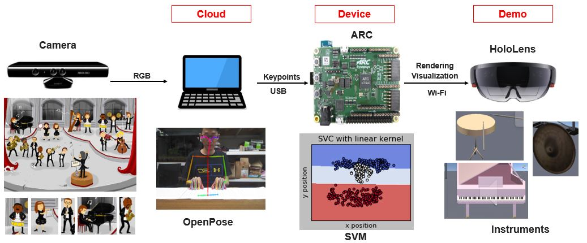

# New Vision World
  Welcome to New Vision World! 
  
  We are ready to show you what does the New Vision World means.
  
Contents
--------
- [Introduction](#Introduction)
- [Hardware Setup](#Hardware-Setup)
- [Software Setup](#Software-Setup)
- [Architecture](#Architecture)
- [User Manual](#User-Manual)

## Introduction

* Kinect camera 

to get RGB information

* OpenPose
* USB-FTDI Driver
* Support vector machines(SVM)
* ARC
* WIFI – TCP/IP 
* HoloLens

## Hardware Setup

## Software Setup

## Architecture

## User Manual

https://www.ftdichip.com/Support/Documents/DataSheets/ICs/DS_FT2232H.pdf

