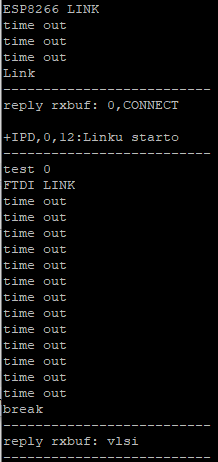

# New Vision World
  Welcome to New Vision World! 
  
  We are ready to show you how New Vision World works.
  
Contents
--------
- [Introduction](#Introduction)
- [Hardware Setup](#Hardware-Setup)
- [Software Setup](#Software-Setup)
- [Architecture](#Architecture)
- [User Manual](#User-Manual)

## Introduction

  Due to the development of science and technology, people's concept of musical instruments of various forms has gradually changed. The somatosensory technology combined with character motion sensing and hand gesture recognition is the trend in the future. Therefore, it is thought to apply finger recognition to virtual playing instruments. This work combines the possibilities of technology and music multimedia.

* Flow chart

  System begins in Kinect camera to get RGB information of image. Through the open source called OpenPose, we can generate skeleton of body and keypoints of two hands. Then the computer outputs these information to ARC and doing SVM algorithm to verify each instrument with many different sounds. After getting the result of verification and sounds, we output the data to HoloLens to have a real stage to perform every instuments. The main flow is following:
  

  
## Hardware Setup

* Kinect for Xbox 360 (Kinect) camera 

    Kinect is created by Microsoft and it has three lens. We use kinect to get real-time RGB information for each image. Before we driver kinect, we use the library called Open Natural Interface(OpenNI) to finish driving.

* ARC

  [See toolchain for much more detail.](https://github.com/foss-for-synopsys-dwc-arc-processors)
  
  
  1. Start the ARC to transfer or read data.
  
      
  
  2. Sure to connect correctly and start to recieve data.
  
      
  
      
  
* HoloLens

  Microsoft HoloLens is an Augmented Reality (AR) device developed by Microsoft. It is part of the Windows Mixed Reality AR Platform incorporated with Windows 10 OS. Similar to other OHMDs (optical head-mounted displays), HoloLens is a see-through display worn over your eyes. Unlike the Oculus Rift and other VR Devices, the eye-piece component of HoloLens is transparent and the headset requires neither PC nor smartphone. It is able to project high-definition (HD) virtual content or holograms over real world objects. 

  
  
## Software Setup

* ARC GNU Toolchain

* OpenPose

    [OpenPose](https://github.com/CMU-Perceptual-Computing-Lab/openpose) represents the first real-time multi-person system to jointly detect human body, hand, facial, and foot keypoints (in total 135 keypoints) on single images.It is authored by Gines Hidalgo, Zhe Cao, Tomas Simon, Shih-En Wei, Hanbyul Joo, and Yaser Sheikh. Currently, it is being maintained by Gines Hidalgo and Yaadhav Raaj. It has been widely used in many applications. Here, in order to verify different instruments, we gonna use these body and hands information to do SVM training and testing.  The skeleton of body and keypoints of hands are following:
   
   

* USB-FTDI Driver

  It needs to transfer data between the computer and ARC through USB. We choose FT2232HL chip to transfer. [See the document we use.](https://www.intra2net.com/en/developer/libftdi/download.php)
  
  
  

* Support vector machines(SVM)

  SVM is a discriminative classifier formally defined by a separating hyperplane. In other words, given labeled training data (supervised learning), the algorithm outputs an optimal hyperplane which categorizes new examples. In two dimentional space this hyperplane is a line dividing a plane in two parts where in each class lay in either side. We train model with 600 datas to three catrgories. The results with different setting of kernel is following:
  
  

* WIFI – TCP/IP 

  The WIFI module we used is ESP8266. ARC is the srver and HoloLens is the client. When HoloLens connect to ARC, ARC will transfer 32-bits data contiuously to HoloLens. The flow is following:

  
 
## Architecture

## User Manual

